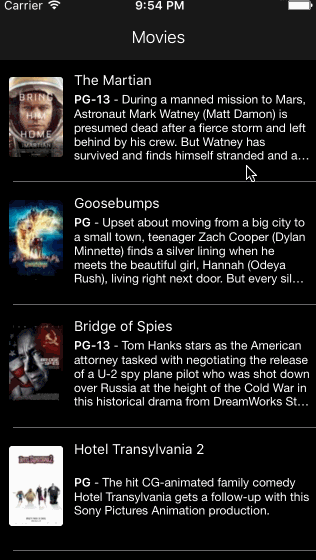

# rotten-tomatoes

This is a movies app displaying box office and top rental DVDs using the Rotten Tomatoes API.

Time spent: <Number of hours spent>

Features
Required

* [x] User can view a list of movies. Poster images load asynchronously.
* [x] User can view movie details by tapping on a cell.
* [x] User sees loading state while waiting for the API.
* [x] User sees error message when there is a network error: cl.ly/image/1l1L3M460c3C
* [x] User can pull to refresh the movie list.

Optional
* [x] All images fade in.
* [x] Customize the highlight and selection effect of the cell.

GIF created with [LiceCap](http://www.cockos.com/licecap/).